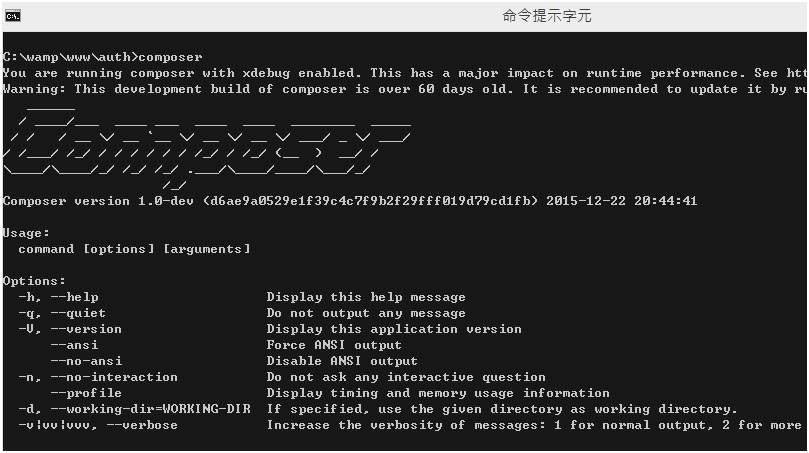
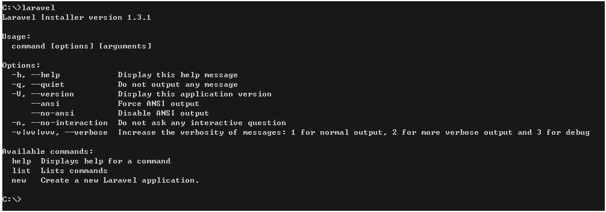

#安裝在 Windows 7 上

以下是win7的作法


##安裝composer

基本起手式，方便管理套件。


###使用安裝程序
先到 [composer官網](http://getcomposer.ycnets.com/doc/00-intro.md) 下載 
 [Composer-Setup.exe](https://getcomposer.org/Composer-Setup.exe)
 

在命令提示鍵元(CMD)中輸入
```
composer
```

如果跑出

>

* **安裝完畢，記得重新開機。**

 
#安裝laravel

 ###伺服器需求

  * PHP >= 5.5.9
  * OpenSSL PHP Extension
  * PDO PHP Extension
  * Mbstring PHP Extension
  * Tokenizer PHP Extension
 

 ```
這裡的意思是
你的PHP版本要5.5.9以上

之後到php.ini 把
extension=php_openssl.dll 
extension=php_pdo_mysql.dll 
extension=php_mbstring.dll
extension=php_exif.dll
前面的;拿掉

Tokenizer 沒看到?

去phpinfo看看應該預設打開了(enable)
其他的也檢查一遍

 ```

PS : 如果明明改好了phpinfo上卻顯示沒有開啟呢? 重開機吧。

 
 ###安裝Laravel安裝包
 
 打開CMD，cd到www底下，執行安裝
 

```
composer global require "laravel/installer"
```

 (另外一種方式)
```
composer global require "laravel/installer=~1.1"
```


安裝完畢

這時可以測試

```
laravel
```
應會顯示

>

完成!!

---


如果報錯，或說沒有這個指令的話。

打開控制台，找到系統->進階系統設定->環境變數->系統變數，

裡面有個變數叫 'path' ， 這時請小心動作。

**首先，在變數最尾端加上 ```;``` **

接著加上

```
C:\Users\你的帳號\AppData\Roaming\Composer\vendor\bin
```

依照這個路徑找應該有兩個檔案 laravel 與 laravel.bat <br>
(AppData資料夾被隱藏起來了，直接輸入就會找到)


