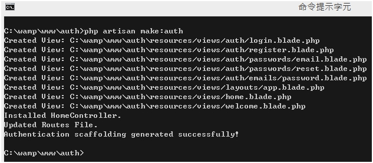
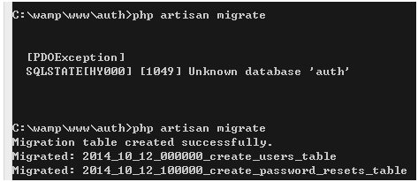
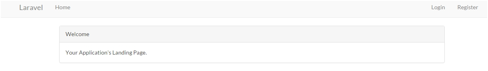
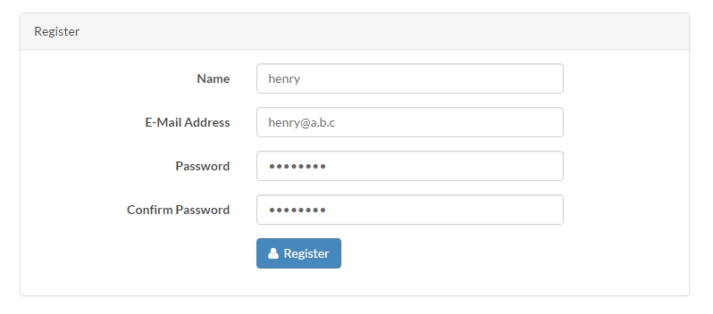
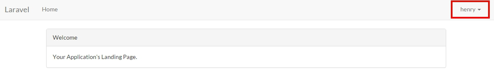

# Authentication 認證


##開新的專案

使用CMD，先cd到你的 www 底下，輸入 `laravel new auth ` 建置一個新的auth專案，等待自動建置完畢。

接著cd進去，輸入php artisan serve，可以看到 http://localhost:8000/ 的 Laravel 標誌。

>
##接著新增資料庫

首先去資料庫新增一個auth資料庫，資料庫的位置通常是localhost，我們來到資料夾中找到 `.env`

依照資料庫修改一下

```php 
DB_HOST=localhost
DB_DATABASE=auth
DB_USERNAME=你登入資料庫的使用者名稱
DB_PASSWORD=密碼 
```

##載入auth預設資料

關掉伺服器(ctrl+C)，輸入 ``` php artisan make:auth ```

>

這時去database->migration可以看到

2014_10_12_000000_create_users_table.php
2014_10_12_100000_create_password_resets_table.php

這是幫你做好預設的兩個資料表

這時在CMD中輸入 `php artisan migrate`

>

如果沒有先新增auth資料庫，就會報錯。

```php
[PDOException]
SQLSTATE[HY000] [1049] Unknown database 'auth'
```

新增auth資料庫成功後資料庫會出現三個資料表，
第一個是migrate紀錄 	migrations
第二個密碼更改紀錄   password_resets
第三個使用者資料   	users

>


哈這個模組真好用直接幫你把會員資料做好了

##註冊資料

現在我們來註冊看看吧

>

成功後會回到 welcome 頁


>


按下 Home 會出現恭喜你登入了。
但右側的狀態看起來就像還沒登入過一樣。

這樣不對，所以我們修改一下程式碼。

##Route.php

原本的資料
```php
<?php

Route::get('/', function () {
    return view('welcome');
});

Route::group(['middleware' => ['web']], function () {
    //
});

Route::group(['middleware' => 'web'], function () {
    Route::auth();

    Route::get('/home', 'HomeController@index');
});
?>
```
可以看到我們剛剛打開 http://localhost:8000 就是從 `get('/', function ...` 進入 `view('welcome');`

修改一下程式碼

```php
<?php
Route::group(['middleware' => 'web'], function () {
    //middleware的使用方法在下一章
    Route::auth();
    //將進入頁包在middleware中
    Route::get('/', function () {
        return view('welcome');
    });
    //
    Route::get('/home', 'HomeController@index');
});
?>
```

回到網頁，登出後，在用剛才的帳號密碼登入一次。

就會看到我們在 進入頁 / 根目錄底下也是登入的狀態了。

>

##重點整理

middleware可視為一個必須經過帳號登入才可進入的區域。


