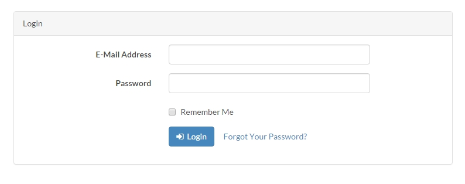

# middleware 中介層

中介層你可以想像是一個關卡，只有合乎標準才可以進入。

##插入新Route測試

我們加上一個新的Route Function程式碼，插入middleware中

```php
Route::group(['middleware' => 'web'], function () {
    Route::auth();
    Route::get('/', function () {
        return view('welcome');
    });
    //新的進入頁
    Route::get('access', function (){
        echo "你進來囉!";
    });

    Route::get('/home', 'HomeController@index');
});
```
這時我們登出後，前往 http://localhost:8000/access

可以看到 

>你進來囉!

##確認授權

這不是我們要的，沒有登入就應該轉到登入頁。

我們修改Route.php

```php  
    Route::get('access', function (){
        echo "你進來囉!";
        //先進行身分判斷
    })->middleware('auth');
```
這時進入 http://localhost:8000/access 後

**會被導到登入頁，請求登入。**

>

現在我們登入後，再前往 http://localhost:8000/access 

就可以看到 

> 你進來囉!

##說明

我們可以了解這是經過``` ->middleware('auth'); ```的判斷才有的，

但是為何``` Route::get('/home', 'HomeController@index'); ```
也有一樣的效果呢?

我們進入HomeController.php可以看到，原來他在建構子內就有預設判斷了
```php 
public function __construct()
    {
        $this->middleware('auth');
    }
```
好 ， 那麼這個 `middleware('auth');` 是甚麼?

其實是在 Route.php 同一層資料夾裡的 kernel.php 去做定義的。([kernel說明](#kernel-說明))


```php
  'auth' => \App\Http\Middleware\Authenticate::class,
```


##kernel 說明

```php
<?php

namespace App\Http;

use Illuminate\Foundation\Http\Kernel as HttpKernel;

class Kernel extends HttpKernel
{
    /**
     * The application's global HTTP middleware stack.
     *
     * These middleware are run during every request to your application.
     * 這裡是全域中介層的堆疊
     * @var array
     */
    protected $middleware = [
        \Illuminate\Foundation\Http\Middleware\CheckForMaintenanceMode::class, // 檢查應用程式是不是維護中
    ];

    /**
     * The application's route middleware groups.
     * 這裡是路由中介層，將中介層分類後打包一起使用。
     * 
     * //使用方式:
     * // Route::group(['middleware' => ['web']], function () {
     * //   // #code...
     * // });
     *
     * 順便解釋一下
     * \App\Http\Middleware\EncryptCookies
     * 意思是從\根目錄開始看app\Http\Middleware\
     * 
     * \Illuminate\Cookie\Middleware\AddQueuedCookiesToResponse
     * 
     * @var array
     */
    protected $middlewareGroups = [
        'web' => [
            \App\Http\Middleware\EncryptCookies::class,                         // 加密 Cookies
            \Illuminate\Cookie\Middleware\AddQueuedCookiesToResponse::class,    // 加入 Queued Cookies 到 Response
            \Illuminate\Session\Middleware\StartSession::class,                 // 開啟 Session
            \Illuminate\View\Middleware\ShareErrorsFromSession::class,          // 從 Session 中共享錯誤資訊
            \App\Http\Middleware\VerifyCsrfToken::class,                        // 驗證 CSRF Token
        ],

        'api' => [
            'throttle:60,1',
        ],
    ];

         
    /**
     * The application's route middleware.
     * 這裡也是路由中介層，可以單獨使用或打包使用。
     * These middleware may be assigned to groups or used individually.
     *
     * @var array
     */
    protected $routeMiddleware = [
        'auth' => \App\Http\Middleware\Authenticate::class,                             //
        'auth.basic' => \Illuminate\Auth\Middleware\AuthenticateWithBasicAuth::class,   //
        'guest' => \App\Http\Middleware\RedirectIfAuthenticated::class,                 //
        'throttle' => \Illuminate\Routing\Middleware\ThrottleRequests::class,           //
        'isAdmin' => \App\Http\Middleware\Adminmiddleware::class,                 //我在這裡加上後，Route.php才可以使用 isAdmin
    ];
}

```


