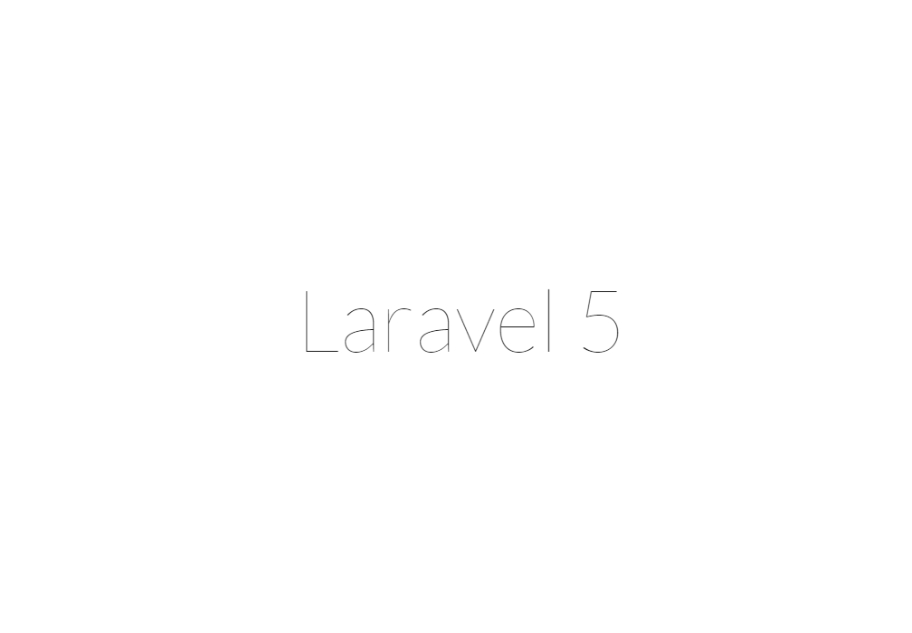

# Route路由器


就是掌管個網站的網址連結


##位置

位於APP資料夾底下的Http資料夾內的Routes.php


##初始內容


##打開首頁

當你在命令提示建元(CMD)中輸入

```
# 前往Laravel專案資料夾
cd C://..../專案資料夾

# 開啟Laravel內建伺服器
php artisan serve 

# 可以看到下方出現
# Laravel development server started on http://localhost:8000/
```

打開網頁( http://localhost:8000/ )可以看見Laravel5
>

PS : ctrl+C ，可以關閉伺服器，中止執行server，這要記住。

##解釋

因為Laravel已經將首頁的路由設定好

```php
Route::get('/', function () {
    return view('welcome');
});
```
`/`代表預設根目錄。
`return view(welcome);`
是指到resources資料夾中view資料夾中的welcome.blade.php這支php，
為何名稱中間會有blade，之後在第七章中會解釋。

```html
<!DOCTYPE html>
<html>
    <head>
        <title>Laravel</title>

        <link href="https://fonts.googleapis.com/css?family=Lato:100" rel="stylesheet" type="text/css">

        <style>
            html, body {
                height: 100%;
            }

            body {
                margin: 0;
                padding: 0;
                width: 100%;
                display: table;
                font-weight: 100;
                font-family: 'Lato';
            }

            .container {
                text-align: center;
                display: table-cell;
                vertical-align: middle;
            }

            .content {
                text-align: center;
                display: inline-block;
            }

            .title {
                font-size: 96px;
            }
        </style>
    </head>
    <body>
        <div class="container">
            <div class="content">
                <div class="title">Laravel 5</div>
            </div>
        </div>
    </body>
</html>
```
可以看到就是很簡單的html檔案。
```html
<div class="title">Laravel 5</div></div>
```
這就是首頁看到的 Laravel 5 


##試著自己做一個

在routes.php當中加入下面程式碼

```php
Route::get('hello', function () {
    echo "Hello there!!";
});
```
打開( http://localhost:8000/hello )可以看到

>

就是這麼簡單。

##我們再來修改一下

將原有程式碼改為下面程式碼

```
Route::get('hello/{name}', function($name){
    echo 'Hello There ' . $name;
});
```
打開( http://localhost:8000/hello/henry )可以看到

>


網址中的henry可以隨意更改成自己要的字串，並得到不同的結果，由此可以清楚明白，我們可以藉由網址輸入參數。


##進階

這次我們輸入以下程式碼

```php
// 第一個Route
Route::post('test', function(){
    echo 'POST';
});
// 第二個Route
Route::get('test', function(){
    echo 'GET';
});
// 第三個Route
Route::put('test', function(){
    echo 'PUT';
});
// 第四個Route
Route::delete('test', function(){
    echo 'DELETE';
});

```

打開( http://localhost:8000/test )可以看到

GET

這時會出現第二個Route中的GET，
因為只有他是用get方式取得的資料。


 * **POST**

假使我們在當中加入一個送出按鍵，使用post方式傳送。

修改程式碼為

```php
Route::post('test', function(){
    echo 'POST';
});

Route::get('test', function(){
    echo '<form method="POST" action="test">';
    echo '<input type="submit">';
    echo '</form>';
});

Route::put('test', function(){
    echo 'PUT';
});

Route::delete('test', function(){
    echo 'DELETE';
});

```
這時重新整理資料會有個按鍵，按下後會出現。

POST

此時顯示的就是第一個路由器的方法了。


 * **PUT** 

那其他的方法呢?

修改程式碼添加
```echo '<input type="hidden" value="PUT" name="_method">';  ```
在表單中，表示要使用的是PUT方法。

```
Route::post('test', function(){
    echo 'POST';
});

Route::get('test', function(){
    echo '<form method="POST" action="test">';
    echo '<input type="submit">';
    echo '<input type="hidden" value="PUT" name="_method">';
    echo '</form>';
});

Route::put('test', function(){
    echo 'PUT';
});

Route::delete('test', function(){
    echo 'DELETE';
});

```

此時打開( http://localhost:8000/test )按下送出。
就會出現

>PUT

此時顯示的就是第三個路由器的方法了。
delete以此類推。

##查看所有路由

因為到最後都會很多路由，如果不知道設定的路由是否成功
可以使用(CMD)查詢所有可連線的路由方法詳細資料

```
//在CMD輸入
php artisan route:list
```


