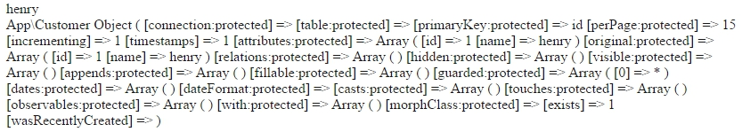

# Model 模組


資料庫與資料表的使用


##設定資料庫


打開.env檔案(在專案資料夾，與其他快樂夥伴同一層)。
如果你沒有就自己複製.env.example開一個。


```JS
APP_ENV=local
APP_DEBUG=true
APP_KEY=SomeRandomString

DB_HOST=127.0.0.1
DB_DATABASE=homestead
DB_USERNAME=homestead
DB_PASSWORD=secret

CACHE_DRIVER=file
SESSION_DRIVER=file
QUEUE_DRIVER=sync

REDIS_HOST=127.0.0.1
REDIS_PASSWORD=null
REDIS_PORT=6379

MAIL_DRIVER=smtp
MAIL_HOST=mailtrap.io
MAIL_PORT=2525
MAIL_USERNAME=null
MAIL_PASSWORD=null
MAIL_ENCRYPTION=null


```
當中比較重要的

```js
DB_HOST=127.0.0.1     //資料庫位址(通常是本地端，也可以自己改)
DB_DATABASE=homestead //資料庫名稱
DB_USERNAME=homestead //資料庫登入帳號
DB_PASSWORD=secret    //登入密碼
```

修改完畢後

<hr>

##資料庫遷移
這部分不在影片當中，可以直接去資料庫創建一個customer資料表
，並自行增加些假資料。
```js
| id | name  |
| ---------- |
| 1  | henry |
| 2  | tony  |

```


```
php artisan make:migration create_customer_table --create=customer
```
```php
<?php

use Illuminate\Database\Schema\Blueprint;
use Illuminate\Database\Migrations\Migration;

class CreateCustomerTable extends Migration
{
    /**
     * 執行遷移。
     *
     * @return void
     */
    public function up()
    {
        Schema::create('customer', function (Blueprint $table) {
            $table->increments('id');
            $table->string('name');
        });
    }

    /**
     * 還原遷移。
     *
     * @return void
     */
    public function down()
    {
        Schema::drop('customer');
    }
}
```

最後在CMD輸入

```
php artisan migrate
```
就可以看到資料庫中的資料表了
Laravel可以隨機產生一些假資料，礙於篇幅還是不介紹了(其實還不熟..)

###假資料

請自行新增兩筆資料

1 henry
2 tony

這樣資料庫內容簡單完成了


<hr>


##創建一個Model


重點來了!!
我們想要使用資料庫中的資料，
必須有個地方負責抓資料。

在CMD輸入
```
php artisan make:model Customer
```
創立一個Model，位於app資料夾中，
打開Customers.php後會看到


```php
<?php

namespace App;

use Illuminate\Database\Eloquent\Model;

class Customer extends Model
{
    //
    public function korders()
    {
        # code...
    }
}

```

好，先不管他。

##回到Routes.php

加入底下程式碼

```php
Route::get('customer', function(){
    //這個很明顯阿!!還記得剛才開的新model檔案，就是用在這裡負責抓資料庫!!
    $customer = App\Customer::find(1); //抓一個
    
    echo $customer->name . "<br/>"; //可以這樣指定資料
    //echo '<pre>'; //這個html tag 可讓array整齊好看
    print_r($customer);
});
```

打開[http://localhost:8000/customer](http://localhost:8000/customer)

>

這樣就抓到資料庫了 Cool~

##利用位址取得參數

將程式碼修改

```
Route::get('customer/{id}', function($id){ //這裡取得參數
    
    $customer = App\Customer::find($id); //根據id抓資料
    
    echo $customer->name . "<br/>";
    
});
```

打開[http://localhost:8000/customer/1](http://localhost:8000/customer/1)
取得id為1的資料

可以看到

>henry

##使用SQL語法

加入底下程式碼

```php
Route::get('customer_id/{id}', function($id){
    //這個很明顯阿!!很像SQL語法嘛!!
    //select * FROM `customer` WHERE `id` = $id  limit 1,1;
    
    $customer = App\Customer::where('id' ,'=' ,$id)->first();
    echo $customer->name;

});

```

打開[http://localhost:8000/customer/2](http://localhost:8000/customer/2)
取得id為2的資料

可以看到

>tony

後面數字可以隨意修改。


---

**重要的額外補充**

```
剛剛很明顯看到了Model可以呼叫資料表，但他是在哪裡去指定這個Model的對應資料表呢?

其實是將Model的名稱後面加上```s```將它命名為資料表名稱即可!!
(後面有y要改成ies!!有s則不變!!)

好像都沒有人提到這個，
當初在學時我花了好些時間才得出來的結論。
```


