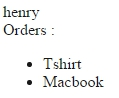

# Relationship 資料表相依關係


這是接續上一章節的內容
主要描述資料表之間的關係
以及簡化的表示法


##先創立第二個Model與其關聯資料表(Model名稱後面加s)

創建一個名為orders的資料表與Order.php(model)
並增加幾筆資料
```php
| id | customer_id  | name      |
|-------------------------------|
| 1  | 1            | Tshirt    |
| 2  | 2            | coffee Mug|
| 3  | 1            | Macbook   |
```

CreateCustomerTable.php

```php
<?php

use Illuminate\Database\Schema\Blueprint;
use Illuminate\Database\Migrations\Migration;

class CreateCustomerTable extends Migration
{
    /**
     * 執行遷移。
     *
     * @return void
     */
    public function up()
    {
        Schema::create('customer', function (Blueprint $table) {
            $table->increments('id');
            $table->integer('customer_id')->unsigned();
            $table->foreign('customer_id')->references('id')->on('customer');
            $table->string('name');
        });
    }

    /**
     * 還原遷移。
     *
     * @return void
     */
    public function down()
    {
        Schema::drop('customer');
    }
}

```

方式不再贅述。


底下

```php
<?php

namespace App;

use Illuminate\Database\Eloquent\Model;

class Order extends Model
{
    
}

```

##關聯資料表-前置作業

在Routes.php增加

```php

Route::get('orders', function(){
    //使用all();將資料全數取出
    $orders = App\Order::all();
    foreach ($orders as  $order) {
        //查詢資料
        //使用$order->customer_id查詢customers資料表中的id欄位(因為他是primary key主鍵)
        $customer = App\Customer::find($order->customer_id);
        
        echo $order->name . ". Ordered by " . $customer->name . "<br/>";
    }
});

```
[http://localhost:8000/orders](http://localhost:8000/orders)
會輸出

>Tshirt. Ordered by henry <br>
>Coffee Mug. Ordered by tony <br>
>Macbook. Ordered by henry <br>


此時用的還是一般的SQL關聯方法

##關聯資料庫- Model


```php
<?php

namespace App;

use Illuminate\Database\Eloquent\Model;

class Order extends Model
{
    //這個方法名稱就是之後你取資料的array名稱，你可以做不同的方法來對應
    public function customer() 
    {
        //這裡使用belongsTo表示一對一(下層對上層) 進行資料表關聯
        //與其對應的上層對下層要用hasOne...，這些都是關鍵字，其他的自己找吧
        return $this->belongsTo('App\Customer');
    }
}

```
其中最關鍵的是 `return $this->belongsTo('App\Customer');`<br>
等同於 `return $this->belongsTo('App\Customer', 'orders.customer_id' , 'customers.id');`<br>
其中 `'App\Customer'` 是你連接的模組。第二個 `'orders.customer_id'` 是現在這個模組要對應的欄位<br>
第三個 `'customers.id'` 則是你想要join的欄位

寫成SQL語法就是 : 
`SELECT * FROM `orders` JOIN `customers` ON `orders`.`customer_id` = `coustomers`.`id`  `

*PS : 我將其資料表名稱一併加入了，
讓你清楚知道這是哪個資料表的欄位。
(如果不是有相同名稱欄位的話是可以省略的)*


**回到Routes.php**

此時就可以修改程式碼為


```php
Route::get('orders', function(){
    //使用all();將資料全數取出
    $orders = App\Order::all();
    
    foreach ($orders as  $order) {
        //使用$order->customer_id查詢customers資料表中的id欄位(因為他是primary key主鍵)
        //$customer = App\Customer::find($order->customer_id);
        
        //不需要繞這麼多彎直接寫方法名稱就可以用了
        echo $order->name . ". Ordered by " . $order->customer->name . "<br/>";
    }
});

```

顯示一樣的結果出來，這樣就是基本的資料表關聯了。
當中customer就是上面的方法。

PS : 如果改名出錯，請修改成 `$this->belongsTo('App\Customer', 'orders.customer_id' , 'customers.id');` 這樣就可以亂取名了


##使用hasMany關鍵字(一對多)

上面我們使用的是belongsTo，代表的是一對一。<br>
現在我們要知道一個人有哪些order，所以使用hasMany一對多，上層(customer)對下層(order)。

修改Model customer.php

```php
<?php

namespace App;

use Illuminate\Database\Eloquent\Model;

class Customer extends Model
{
    //這時資料表名稱試著亂改
    public function forfun()
    {
        return $this->hasMany('App\Order');
        //後面一樣可以更改為
        //return $this->hasMany('App\Order' , `id` , `customer_id`);
    }
}

```


修改Route.php

```php
Route::get('customer/{id}', function($id){
    //這個很明顯阿!!就是抓資料庫!!
    $customer = App\Customer::find($id);
    
    echo $customer->name . "<br/>";
    echo "Orders : <br/>";
    
    //這裡是使用Model裡要使用的function名稱
    $orders = $customer->forfun;
    echo '<ul>';
    foreach ($orders as $order) {
        # code...
        echo '<li>'.$order->name . "</li>";
    }
    echo '</ul>';
    echo '<pre>';
    
});

```

前往
http://localhost:8000/customer/1

 >


---

#個人研究與影片無關


如果你的上層模型(資料表)不是使用 id 作為主鍵，或是你希望以不同的欄位 join 下層模型(資料表)，你可以傳遞第三參數至 belongsTo 方法指定上層資料表的自定鍵：
```php
/**
 * Get the post that owns the comment.
 */
public function post()
{
    return $this->belongsTo('App\Post', 'foreign_key', 'other_key');
}
```

[參考連結](https://laravel.tw/docs/5.2/eloquent-relationships#has-many-through)


