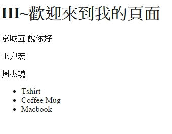

# blade 模板

讓網頁靜態化

可以將php變數資料簡單的加入頁面


##語法不同

原先的
` <?php echo $var1; ?> `
改寫為
` {{ $var1 }}`

所以將mypage.php改寫為

```php
<!DOCTYPE html>
<html>
<head>
	<title>我的頁面</title>
</head>
<body>
<h1>HI~歡迎來到我的頁面</h1>
<p>{{ $var1 }}</p>
<p>{{ $var2 }}</p>
<p>{{ $var3 }}</p>
</body>
</html>
```

這時我們去看http://localhost:8000/mypage

可以看到 

 
**HI~歡迎來到我的頁面**

{{ $var1 }}

{{ $var2 }}

{{ $var3 }}

 
 
 怎麼會這樣
 
 ##檔案命名方式 添加.blade
 
 將mypage.php
 改名為 mypage.blade.php
 
 如此一來就會顯示變數資料了
 
** HI~歡迎來到我的頁面**

京城五

王力宏

周杰魂

##if else 語法

現在我們將程式碼添加一個if判斷式
簡單來說就是

當var1是京城五時 他會說你好 

原本程式碼應該是長這樣
(基本PHP部分不解釋)

```php
<!DOCTYPE html>
<html>
<head>
	<title>我的頁面</title>
</head>
<body>
<h1>HI~歡迎來到我的頁面</h1>
<p>{{ $var1 }}
<?php if($var1=='京城五'): ?> 
<?php echo "說你好"; ?>
<?php endif; ?> 
</p>
<p>{{ $var2 }}</p>
<p>{{ $var3 }}</p>
</body>
</html>
```

##laravel寫法

```php
<!DOCTYPE html>
<html>
<head>
	<title>我的頁面</title>
</head>
<body>
<h1>HI~歡迎來到我的頁面</h1>
<p>{{ $var1 }}
@if($var1=='京城五'):
   說你好 
@endif  
</p>
<p>{{ $var2 }}</p>
<p>{{ $var3 }}</p>
</body>
</html>
```

果然可以

**HI~歡迎來到我的頁面**

京城五 說你好

王力宏

周杰魂


##使用資料庫


從route.php將資料庫資料加入$data中

```php
Route::get('mypage', function () {

$data = array('var1' => '京城五','var2' => '王力宏','var3' => '周杰魂','orders' => App\Order::all() );

    return view('mypage',$data);
});
```
回到頁面
先用基本的方式呼叫出來

```php
<!DOCTYPE html>
<html>
<head>
    <title>我的頁面</title>
</head>
<body>
<h1>HI~歡迎來到我的頁面</h1>
<p>{{ $var1 }}
@if($var1=='京城五')  
   說你好 
@endif
</p>
<p>{{ $var2 }}</p>
<p>{{ $var3 }}</p>
<ul>
<?php foreach($orders as $order): ?>
    <li><?=$order->name;?></li>
<?php endforeach; ?>
</ul>
</body>
</html>
```
結果



##laravel語法


```php
<!DOCTYPE html>
<html>
<head>
    <title>我的頁面</title>
</head>
<body>
<h1>HI~歡迎來到我的頁面</h1>
<p>{{ $var1 }}
@if($var1=='京城五')  
   說你好 
@endif
</p>
<p>{{ $var2 }}</p>
<p>{{ $var3 }}</p>
<ul>
@foreach($orders as $order)
    <li>{{$order->name}}</li>
@endforeach
</ul>
</body>
</html>
```

結果當然也一樣囉~


